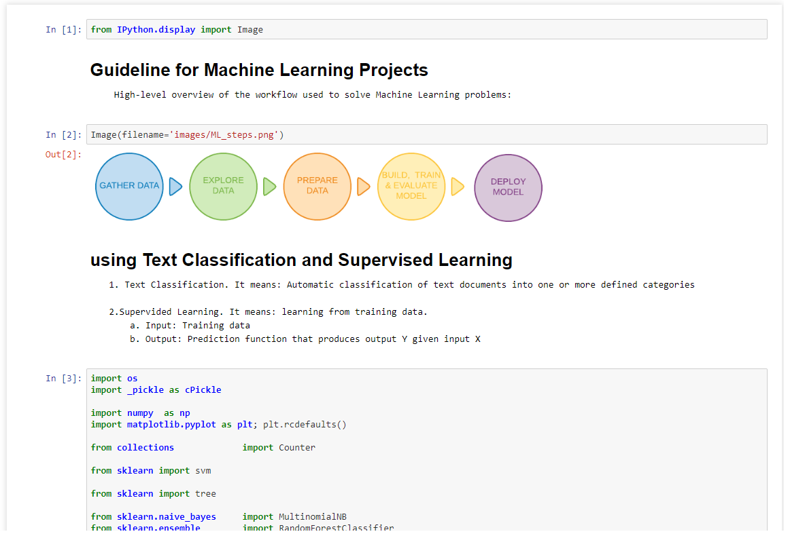

# Guideline for Machine Learning Projects

## Introduction
Guideline for Machine Learning Projects is a document-reference for people that are starting up on the topic of text analytics. It will help you to understand in practice and in theory the work-flow used to solve Machine Learning problems.

This document cover:

  * 1 - How to get data
  * 2 - How to explore your data
  * 3 - How to prepare your data
  * 4 - How to build, train and evaluate Machine Learning Models for Text Classification
  * 5 - How to deploy your Machine Learning Model

The papers used as a reference for this guideline can be found in the `/docs` folder.

* `/docs/papers` - Contains papers related to Machine Learning Models used to solve Text Classification Problems
